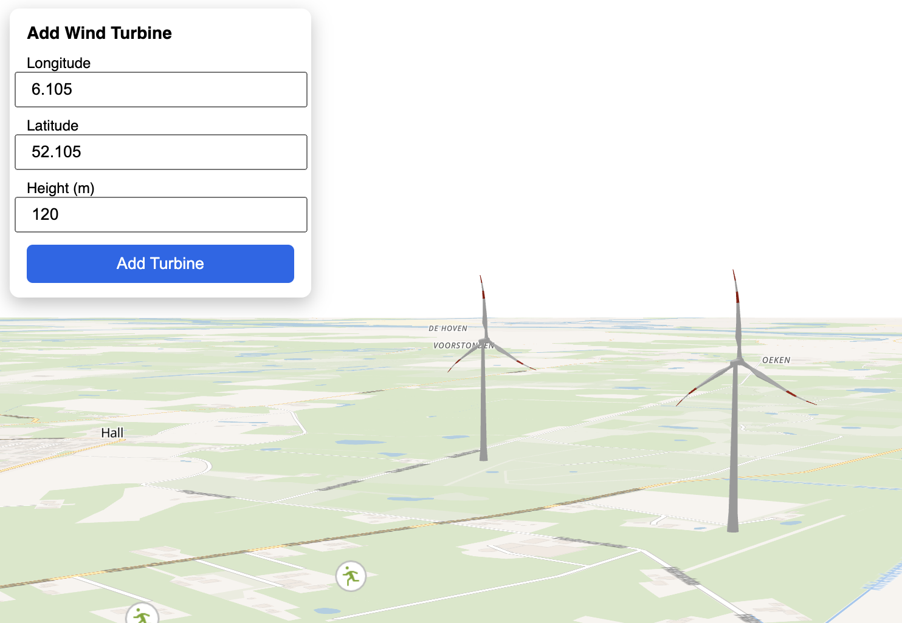

# Turbine mapper

The tool visualises turbines in their natural surrounding.

We strongly encourage the use of reproducable energy sources, such as wind and solar. But we acknowledge
that decissions on landschape design should be carefully made. We hope this tool can facilitate good discussion upfront.
To prevent disappointments.

Visit the tool at [github.io](https://pvgenuchten.github.io/turbine-mapper/).

Save the locations as kmz-file and open in google earth pro for even better visual experience.

Tool uses maplibre and three js to display 3d models on a map background. You can deploy the tool on your github.io by cloning this repo.

